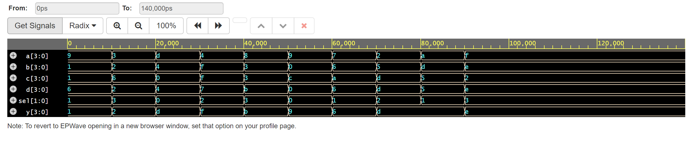
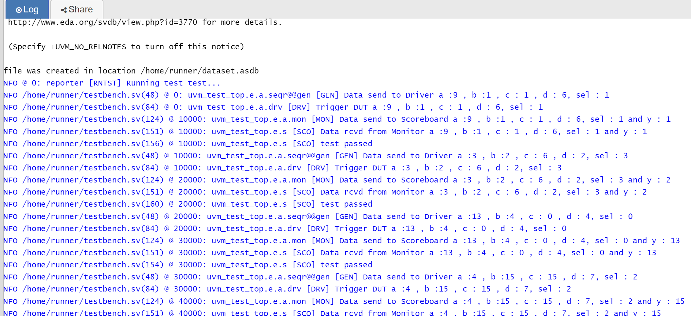

### MULTIPLEXERS

A multiplexer (often abbreviated as mux) is a digital circuit that selects one of several input signals and forwards the selected input to a single output line. The selection of the input signal is controlled by additional inputs known as select lines.

 Output Wave:

 

 Console log :

  
